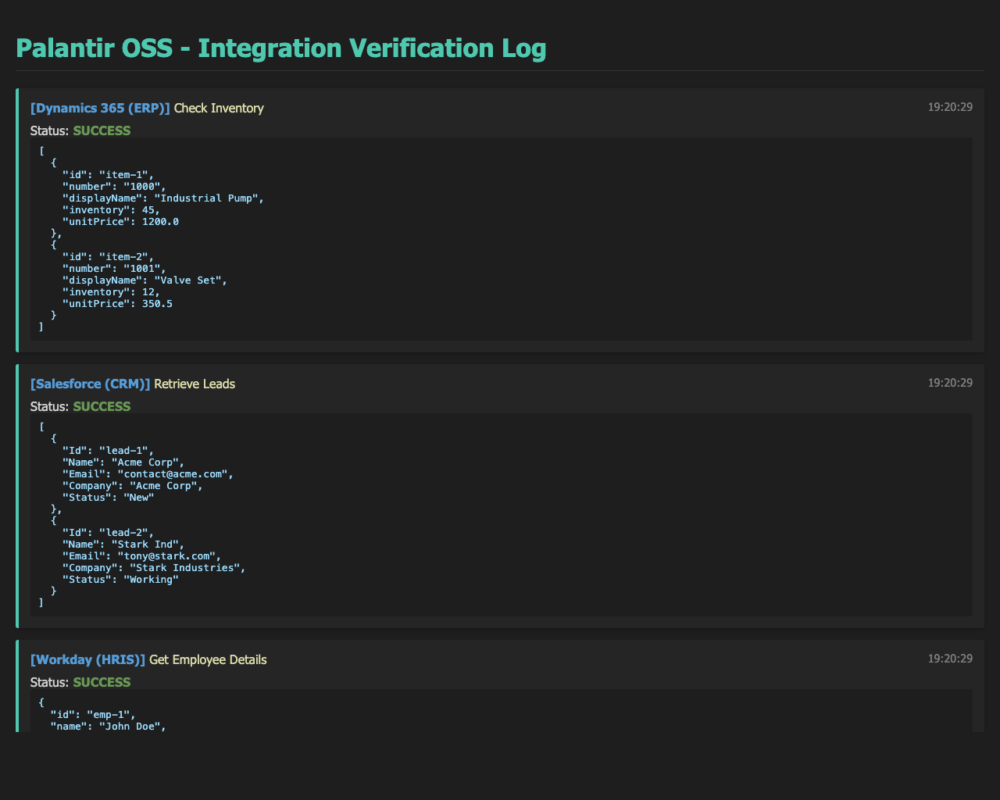

# Palantir OSS

**Palantir OSS** is an open-source, agentic integration platform designed to replicate the core capabilities of the Palantir ecosystem (Foundry, Gotham, AIP, Apollo) using modern open-source technologies. This project provides a robust framework for LLM agents to interact with enterprise systems, data warehouses, and communication tools, enabling "software-defined" business operations.

## End Goal

The ultimate goal of this repository is to build a full, high-fidelity replica of the Palantir ecosystem that empowers enterprises to:
1.  **Integrate** data from disparate sources (ERP, CRM, HRIS, IoT) into a unified ontology.
2.  **Analyze** this data using advanced analytics and AI agents.
3.  **Operationalize** insights by triggering actions back into source systems.
4.  **Deploy** and manage this infrastructure across any environment.

## Architecture & Components

The system is built on a modular architecture with the following core components:

### 1. Enterprise Integrations (`/integrations`)
Real, production-grade API connectors for major enterprise platforms, exposing standard tools for LLM agents.

*   **ERP**: **Microsoft Dynamics 365 Business Central**
    *   *Capabilities*: General Ledger, AP/AR, Purchase/Sales Orders, Inventory.
*   **CRM**: **Salesforce**
    *   *Capabilities*: Leads, Opportunities, CPQ (Quotes, Products).
*   **HRIS**: **Workday**
    *   *Capabilities*: Employee profiles, Org charts, Time-off balances.
*   **ITSM**: **ServiceNow**
    *   *Capabilities*: Incident management, Ticket status.
*   **Data Layer**:
    *   **Snowflake**: SQL-based data warehousing and analytics.
    *   **S3 / Azure Blob**: Object storage for raw files (logs, images, documents).
*   **Knowledge Management**:
    *   **SharePoint**: Document search and retrieval.
    *   **Confluence**: Knowledge base access.
    *   **Jira**: Issue and project tracking.
*   **Communication**:
    *   **Microsoft Teams**: Chat and channel messaging.
    *   **Slack**: Channel messaging.

### 2. Core Infrastructure (`/core`)
*   **`client.py`**: A unified HTTP client wrapper handling retries, error handling, and logging.
*   **`auth.py`**: Robust authentication providers supporting OAuth2 (Client Credentials), Basic Auth, and Bearer Tokens with automatic token refreshing.
*   **`config.py`**: Centralized configuration management using environment variables.

### 3. Agent Framework (`/agent`)
*   **`tools.py`**: Utilities for registering and managing tool definitions (JSON schemas) for LLMs.
*   **`llm.py`**: Interface for interacting with LLM providers (e.g., Gemini, OpenAI).

### 4. RAG Pipeline (`/rag`)
*   **`ingest.py`**: Pipelines for ingesting data from integrations into vector stores.
*   **`store.py`**: Vector database interface for semantic search.

### 5. Frontend (`/nexus-os`)
*   A modern, React-based UI (Next.js/Vite) visualizing the "Nexus OS" dashboard, mimicking the Palantir workspace experience.

## Directory Structure

```text
.
├── agent/                  # Agent framework and tool definitions
├── core/                   # Core infrastructure (Auth, Config, HTTP Client)
├── docs/                   # Documentation and architectural diagrams
├── integrations/           # Enterprise API Connectors
│   ├── comms/              # Teams, Slack
│   ├── crm/                # Salesforce
│   ├── data/               # Snowflake, S3
│   ├── erp/                # Dynamics 365
│   ├── hris/               # Workday
│   ├── itsm/               # ServiceNow
│   └── knowledge/          # SharePoint, Confluence, Jira
├── nexus-os/               # Frontend Application (React/Next.js)
├── rag/                    # RAG Pipeline (Ingestion, Vector Store)
├── products_to_integerate_list/ # Planning documents
├── verify_integrations.py  # Verification script
├── server.py               # Main backend server (FastAPI/MCP)
└── README.md               # This file
```

## Getting Started

### Prerequisites
*   Python 3.9+
*   Node.js 18+ (for frontend)
*   Access to respective enterprise system APIs (Client IDs, Secrets, etc.)

### Installation

1.  **Clone the repository:**
    ```bash
    git clone https://github.com/your-repo/palantir_oss.git
    cd palantir_oss
    ```

2.  **Install Python dependencies:**
    ```bash
    pip install -r requirements.txt
    ```

3.  **Configure Environment:**
    Create a `.env` file based on the variables defined in `core/config.py`. You will need credentials for the services you intend to use.
    *   `D365_CLIENT_ID`, `D365_CLIENT_SECRET`
    *   `SALESFORCE_CLIENT_ID`, `SALESFORCE_CLIENT_SECRET`
    *   `WORKDAY_CLIENT_ID`, `WORKDAY_CLIENT_SECRET`
    *   `SERVICENOW_INSTANCE`, `SERVICENOW_USERNAME`
    *   `SNOWFLAKE_ACCOUNT`, `SNOWFLAKE_USER`
    *   `SLACK_BOT_TOKEN`, etc.

### Usage

**Running the Verification Script:**
To verify that your environment is configured correctly and connectors can be instantiated:
```bash
python3 verify_integrations.py
```

**Using Connectors in Code:**
```python
from integrations.erp.client import ERPConnector
from integrations.crm.client import CRMConnector

# Initialize connectors
erp = ERPConnector()
crm = CRMConnector()

# Get tools for LLM
tools = erp.get_tools() + crm.get_tools()

# Execute a tool
result = erp.execute_tool("erp_get_inventory", item_id="1000")
print(result)
```

## Verification & Demo

We have included a comprehensive demo script `demo_integrations.py` that simulates a full enterprise workflow using mock data (since real credentials are often protected).

To run the demo and generate a visual report:
```bash
python3 demo_integrations.py
```

**Integration Report Output:**


## Future Roadmap

*   **Full Ontology Layer**: Abstracting raw API data into a unified object model (Ontology).
*   **Pipeline Builder**: Visual tool for creating data transformation pipelines.
*   **Action Types**: Defining safe side-effects and write-back capabilities.
*   **Apollo Orchestration**: Automated deployment and config management for agents.
